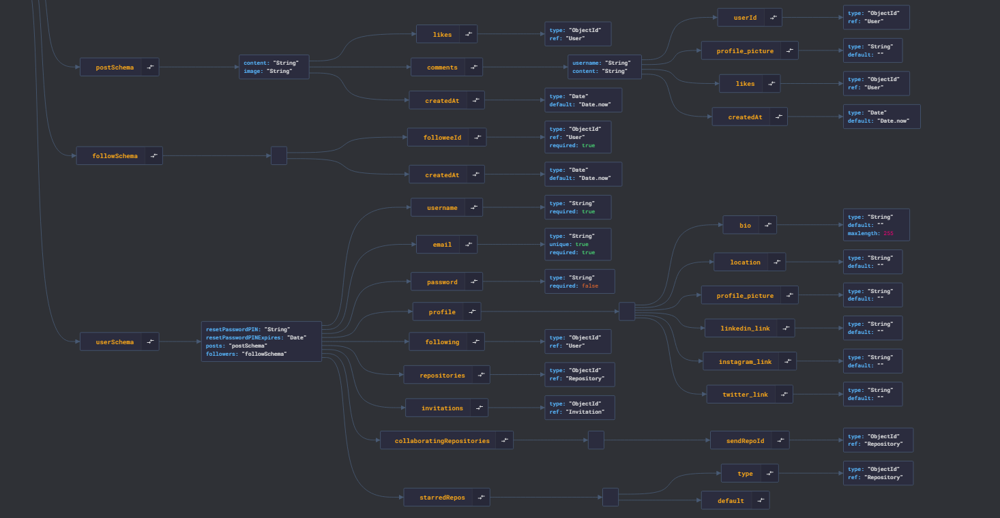
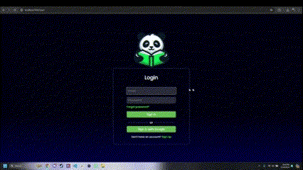
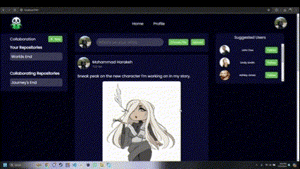

<br><br>

<!-- project philosophy -->


> A platform dedicated to book enthusiasts, fostering creativity and sharing of innovative ideas within the literary community.
>
> BookHub is an online platform tailored for passionate book enthusiasts and avid readers, fostering an environment for idea exchange and collaborative storytelling. With intuitive features, users can seamlessly share insights, embark on collaborative ventures, and merge contributions to weave captivating narratives.

### User Stories

- As a user, I want to browse user posts so that i can get inspired and react to their posts.
- As a user, I want to be able to create a project were i can invite multiple people to collaborate with me on the idea.
- As a user, I want to be able to view previous versions of my project to compare the changes made.

<br><br>

### Collaborator Stories

- As a collaborator, I want to be able to get invited by other users and collaborate with them.
- As a collaborator, I want to be able to modify and make changes to the story.
- As a collaborator, I want the story to be shown in my profile for other people to view.

<br><br>

<!-- Tech stack -->


### BookHub is built using the following technologies:

- This project uses the [Next.js development framework](https://nextjs.org/docs). Next.js is a React-based web framework that enables server-side rendering, static site generation, and other powerful features for building modern web applications.
- The website uses [useContext](https://vercel.com/guides/react-context-state-management-nextjs) for state management, providing a state container. This ensures efficient data flow throughout the application.
- For persistent storage (database), the app uses the [MongoDB](https://www.mongodb.com/) database along with the Mongoose package, enabling the app to create a custom storage schema and interact seamlessly with MongoDB, our chosen database solution.
- This project utilizes [Node.js](https://nodejs.org/en) for backend development. Node.js is a runtime environment that allows developers to use JavaScript for server-side scripting, providing features and modules for efficient backend development. With Node.js, developers can handle routing, database operations, authentication, and API development, enabling the creation of powerful and scalable server-side applications.
- To enrich user experience, our website integrates the advanced [DALLE-3](https://openai.com/index/dall-e-3/) model from [OpenAI](https://openai.com/), harnessing its powerful image generation capabilities. This AI-driven functionality enhances stories created by users by adding vibrant and immersive visuals, bringing their narratives to life with stunning imagery tailored to the context and content of their stories.

<br><br>

<!-- UI UX -->


> We designed BookHub using wireframes and mockups, iterating on the design until we reached the ideal layout for easy navigation and a seamless user experience.

- Project Figma design [figma](https://www.figma.com/design/inyI49RPNgglFLyEqnxoP4/BookHub?node-id=0%3A1&t=eT7vAyPtI8hTCaXL-1)

### Mockups

| Login screen                              | Home Screen                               | Story Screen                           |
| ----------------------------------------- | ----------------------------------------- | -------------------------------------- |
| .png>) | .png>) | .png>) |

<br><br>

<!-- Database Design -->


 

<br><br>

<!-- Implementation -->


### User Screens (Web)

| Login screen                             | Register screen                            |
| ---------------------------------------- | ------------------------------------------ |
|           |               |
| Google Login screen                      | Home Screen                                |
|     |             |
| Create Story screen                      | Commit Story screen                        |
|      |          |
| AI Image screen                          | Invite screen                              |
|   |         |
| Invited Story screen                     | Accept Invite Screen                       |
|     |  |
| Different Versions Screen                |
|  |

<br><br>

<!-- Prompt Engineering -->


At Book Hub, we harness OpenAI's advanced natural language processing and DALL-E 3's creative capabilities to transform your stories into immersive, interactive experiences.

1. **User-Centric Story Collection:**

   Your journey begins with a personalized questionnaire. We analyze your responses to extract key phrases and words that capture your story's essence.

2. **Precise Prompt Crafting:**

   Using these keywords, we create a prompt that guides OpenAI's GPT model to generate a concise, contextually rich summary of your narrative.

3. **Visual Enhancement with DALL-E 3:**

   The summary is then used to generate a high-quality, imaginative image with DALL-E 3, perfectly complementing your story.

4. **Contextual Integration:**

   We enrich your story by integrating AI-generated text and visuals with additional data from our database, enhancing the overall experience.

   Experience AI-driven storytelling with Book Hub, where your stories come to life through the power of OpenAI and DALL-E 3.

   | OpenAi propmpt Screen           |
   | ------------------------------- |
   |  |

<br><br>

<!-- AWS Deployment -->


# Setting up Cloudflare Tunnel and MongoDB on AWS

1.  **Download cloudflared:**

    ```
    wget https://github.com/cloudflare/cloudflared/releases/latest/download/cloudflared-linux-amd64.deb
    ```

2.  **Run the installer:**

    ```
    sudo dpkg -i cloudflared-linux-amd64.deb
    ```

3.  **Authenticate cloudflared on a logged-in account that owns a domain:**

    ```
    cloudflared login
    ```

4.  Create a tunnel:

    ```
    cloudflared tunnel create book-hub
    ```

5.  Copy the ID of the tunnel from the output.

    ```
    cd ~/.cloudflared
    ```

6.  Edit the config file:

    ```
    nano config.yml
    ```

7.  Enter the following into the config file:

    ```
    tunnel: tunnel-id-copied
    credentials-file: /home/ubuntu/.cloudflared/tunnel-id-copied.json

    ingress:

    - hostname: yourdomainconfigured
      service: http://localhost:3001
    - service: http_status:404
    ```

8.  Run cloudflared:

    ```
    cloudflared tunnel run tunnel-name
    ```

9.  Install MongoDB

    ```
    sudo apt install -y mongodb-org
    ```

10. Start MongoDB service:

    ```
    sudo systemctl start mongod
    ```

11. Enable MongoDB service to start on boot:

    ```
    sudo systemctl enable mongod
    ```

12. Start HTTPD (Apache) service:

          ```
          sudo systemctl start httpd
          ```

13. Enable HTTPD (Apache) service to start on boot:

    ```
    sudo systemctl enable httpd
    ```

14. Start MongoDB service:

    ```
    sudo systemctl start mongod
    ```

15. Enable MongoDB service to start on boot:

    ```
    sudo systemctl enable mongod
    ```

    <br><br>

<!-- Unit Testing -->


### Precision in Development: Harnessing the Power of Unit Testing:

- This project employs rigorous unit testing methodologies to ensure the reliability and accuracy of code components. By systematically evaluating individual units of the software, we guarantee a robust foundation, identifying and addressing potential issues early in the development process.

<br><br>

<!-- How to run -->


> To set up BookHub locally, follow these steps:

### Prerequisites

1. Install [Node & NPM](https://nodejs.org/en/download/package-manager)

2. Run npm install

3. Create a .env file and add the below information

   ```
   JWT_SECRET_KEY=
   TOKEN_HEADER_KEY=
   NEXT_PUBLIC_GOOGLE_CLIENT_ID=
   OPENAI_API_KEY=
   GOOGLE_EMAIL=
   GOOGLE_PASS=
   MONGODB_URI=
   PORT=
   ```

4. run the frontend using

   ```
   npm run dev
   ```

5. run the backend using

   ```
   nodemon .
   ```
